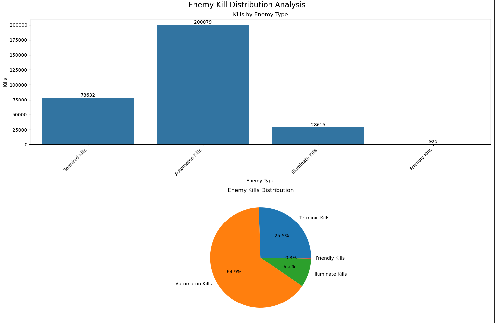
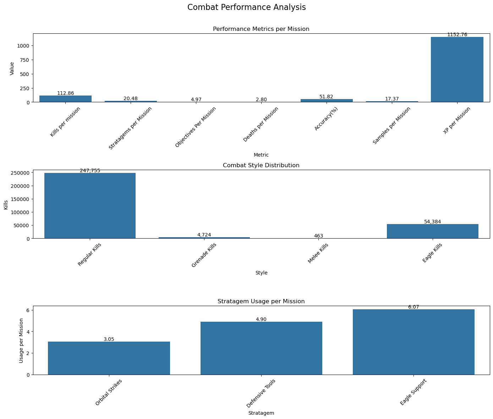
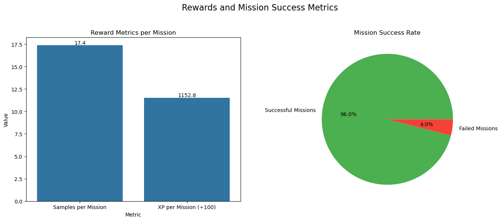

## Helldivers 2 Data Visualization
This is a basic data visualization of a single players 'Career' stats from the videogame Helldivers 2. The data is taken from the in game stats, and then visualized using Python and Jupyter Notebook.
As of now we are only looking at a single players stats.

The current data visualization covers the following:
- Enemy Distribution Analysis
- Combat Performance Analysis
- Rewards and Mission Success Metrics

[Data Visualization Notebook Here](camp_viz.ipynb)

## Diving into the Numbers

For more information about the game follow the link below:
[Helldivers 2 Wiki](https://helldivers.wiki.gg/wiki/Helldivers_2)

## Statsitical Analysis Results 
```
=== Statistical Analysis Results ===

Efficiency Metrics (per Mission):
Total Kills: 307326
Kills per mission: 112.86
Stratagems per Mission: 20.48
Objectives Per Mission: 4.97
Deaths per Mission: 2.80
Accuracy(%): 51.82
Samples per Mission: 17.37
XP per Mission: 1152.76

Combat Style Distribution:
Regular Kills: 247,755 (80.6%)
Grenade Kills: 4,724 (1.5%)
Melee Kills: 463 (0.2%)
Eagle Kills: 54,384 (17.7%)

Stratagem Efficiency (per Mission):
Orbital Strikes: 3.05
Defensive Tools: 4.90
Eagle Support: 6.07

Mission Performance Metrics:
Success Rate: 96.0%
Extraction Rate: 84.1%
Objectives Completed per Mission: 4.97
Samples Collected per Mission: 17.37
XP Earned per Mission: 1152.76
```

## Enemy Distribution



- The stats are listed in the players Career tab. Total "Career Kills" is listed, but there were initial issues when comparing the totals from the sum of faction kills to total career kills. Arrowhead has fixed the issue, but I still did the calculations manually rather than using the given values. 

- Illuminates were introduced in mid December 2024, so the data is skewed towards the Automatons and Terminids since they were included during launch.

- `Friendly Kills`: This value is a bit high for my liking, but using sentries can lead to 3 friendly kills in a mission. Bringing bombardments for the eradicate mission also helps increase this.

## Combat Performance Analysis



- `Kills per Mission`: Players received a buff after complaints from the community. I recall completing automaton missions with double-digit kills. After the buff, and the increase of defensive stratagems helped increase this value. 

- `Regular Kills`: Are kills from using main, and secondary weapons, and defensive stratagems. This also includes usages of `orbital` stratagems. 

- `Accuracy`: I use a controller on a PC just for comfort. This can  be improved.

- `Eagle Support`: This doubles the `Orbital` usage because the `Eagle Strikes` have multiple uses before re-arming. For example, the `Strafing Run` has 5 uses before it re-arms and the cooldown wait is 120 seconds. While the `Orbital Laser` has 3 uses per mission and after each use it has a 300 second cooldown. 

- `Defensive Strats`: These stratagems are sentries, mines, and emplacements. My main usage are sentries. 

## Rewards and Mission Success


### Samples Earned
- Each member receives all the samples that each diver/player extracted with. Meaning that each player gets the total sample count. 

- Samples are used to gain ship upgrades. This includes decrease in weapon dropdown speed, weapons and, stratagem cooldown, increase in orbital salvo and much more.

- Post mission career stats show "Samples Extracted" which tallies the amount of samples a player sample extracted with. However, "Samples Collected" takes the total samples collected. For example I extracted with 10 samples, while the groups total was 11. Career Samples Collected increased by 11 instead of 10.

### XP (Experience Points)
- Experience points increases depending on the level played. Currently there are 10 difficulty levels from 1-10. Players earn more as a group along with total objectives completed. Where level 10 has a 300x multiplier for XP earned. The XP earned depends on the mission type which is then multiplied.

### Extraction Rate
- **Not in Image**. This seems a little low, but before the playes received a buff it was much harder to extract at the highest level of diffuclty. Plus there were people that would do `friendly kills` at extraction.

For more info:
[Helldivers 2 XP Farming Guide](https://game8.co/games/Helldivers-2/archives/446460#hl_2)

## Operation and Missions

- An operation consists of 3 missions. 

- Two full missions, which you have 40 minutes to complete the main mission. Side objectives, and clearing bases or bug holes are optional.

- One Short mission that is either a blitz, eradicate, clearing the bases or bug holes, and a defense mission. The lengths for each mission is 12, 15, and 20 minutes.


## Notes:
The players stats for this game is very limited and is not as in-depth compared to Marvel Rivals(not advertising). Rivals is a free to play online Player vs. Player (PvP) game, hence the advanced stats collection. The data collected for each character is impressive compared to what Helldivers has. I have created a list on which stats would have been nice to have included:

- Count for each mission type against all factions. Including success, and extraction data. I want to keep track of how many times my group and I have failed a `Raise the Flag` mission against the bots.

- Average time per full mission type. To make it easy average time per full mission, and blitz.

- Mission Success and extraction rate per difficulty level.

- Tally of secondary weapon usage. I used the Autocannon almost 
exclusively before they made the game easier.

- Secondary weapon usage stats. How accurate are you with that Railgun?

- Extraction data per faction.

- Samples collected per faction. 

- Outposts cleared or fabricators destroyed, bug holes closed, ships destroyed etc.

These are the ones I can think of on the top  of my head.
