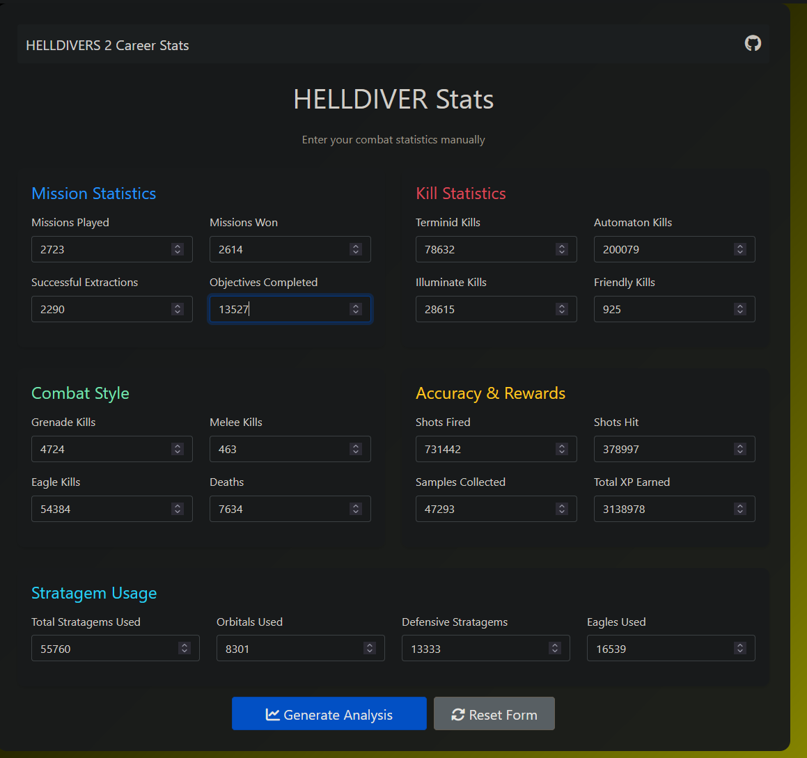

# HD2 Career Stats

**Data Visualization is Live at the link below:**

**[HD2-Career-Stats](https://hd2-career-stats.onrender.com)**


--


## Technologies Used
- Python
- Flask
- Pandas
- Matplotlib
- Seaborn
- Jupyter Notebook
- HTML
-- 

## Helldivers 2 Player Career Data Visualization
The project was originally a Data Visualization project using Python and Jupyter Notebook to analyze a single player's 'Career' stats from the videogame Helldivers 2. The data is taken from the in-game stats, and then visualized using Python and Jupyter Notebook.


**Original Version located in the [Original Files](./Original-Files/) directory.**

## Updated Version
The project has been updated as a Flask web application. The Flask app serves the data visualization and allows users to interact with the data more dynamically.

## Requirements
To run the Flask app, you need to have Python installed on your machine. You can download it from [python.org](https://www.python.org/downloads/).

or Anaconda distribution which includes Python and many useful libraries for data science.


### Run Locally for Development


from a command shell or terminal (assuming Git is installed), navigate to the project directory and run:
make sure you are in the directory with the requirements.txt file

```bash
git pull # to get the lastest version of the code
```

```bash
pip install -r requirements.txt 
```

### Make changes to the code to run locally
in `app.py`, ensure the the following are commented out:
```python
app = Flask(__name__)
#app.secret_key = os.environ.get('SECRET_KEY', 'dev-key-only')
#app.config['MAX_CONTENT_LENGTH'] = 16 * 1024 * 1024 # 16mb file size
```
```python
if __name__ == '__main__':
    port = int(os.environ.get('PORT', 5000))
    # serve(app, host='0.0.0.0', port=port)
    app.run(host='0.0.0.0.', port=port, debug=True)  # Use debug=True for development
```

### Running the Flask App
from the same terminal, and directory, run the following command to start the Flask app:
```bash
python app.py
```

**The Flask app will start, and you can access it in your web browser at `http://localhost:5000`**

### Requirement.txt
```
Flask==2.3.3
pandas==2.0.3
matplotlib==3.7.2
seaborn==0.12.2
```